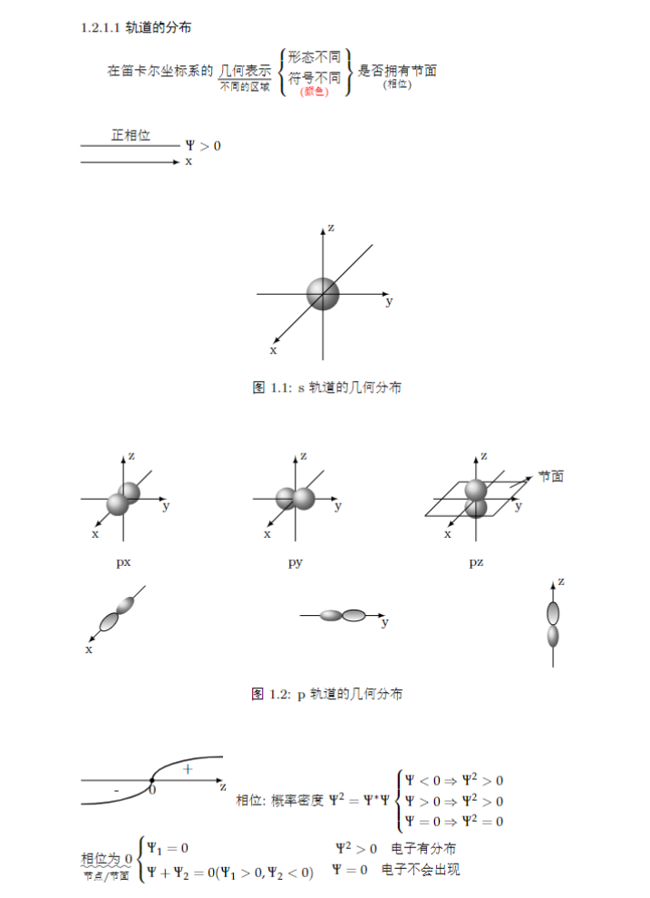
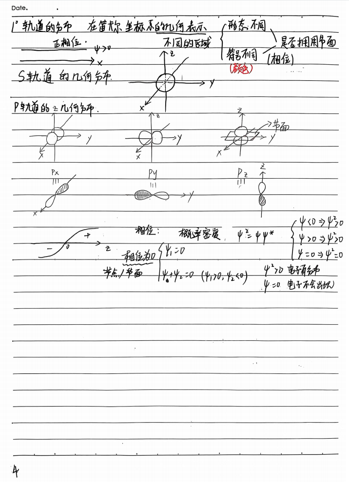
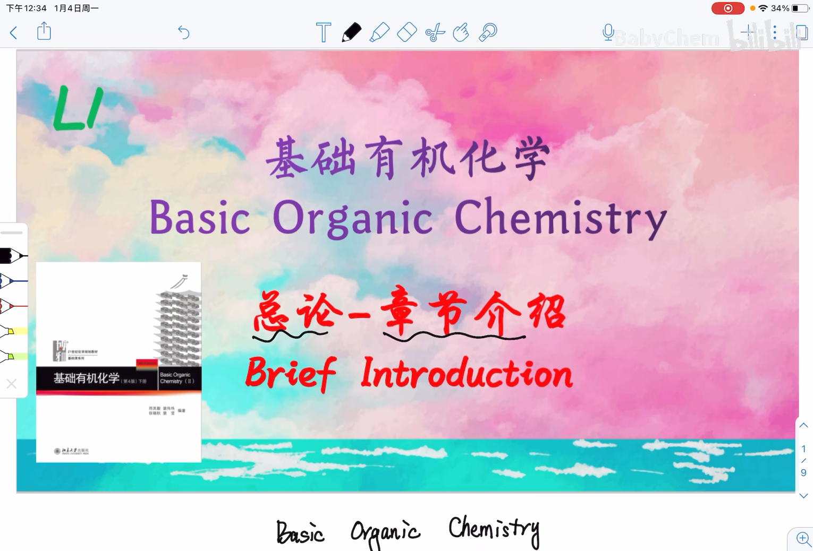

# BabyChem基础有机化学

## 想法

将手写笔记用latex写出来

## 进度

* 第一章

## [预览](main.pdf)

|  |  |
| --- | --- |

## 遇到的困难

里面全是史山代码，tex里好多报错，不知道怎么解决，呜呜呜  
全是化学式结构图，能量曲线，能级图，好难画  
为了和手写笔记基本上吻合，花了很多功夫  

## 手动编译

* VSCode拓展下载LaTeX Workshop
* 设置>搜索`Latex-workshop › Latex: Recipes`>在 settings.json 中编辑
* 将内容替换成[.vscode/settings.json](.vscode/settings.json)
* 在main.tex中`Ctrl`+`Alt`+`B`编译成PDF

## 致谢

* [szaboqc](https://github.com/Usu171/szaboqc)

## 文件下载&讲解视频

**[BabyChem基础有机化学手写笔记](https://github.com/Benzyl-titanium/BabyChem/releases/download/organic-chemistry/BabyChem.pdf)**

