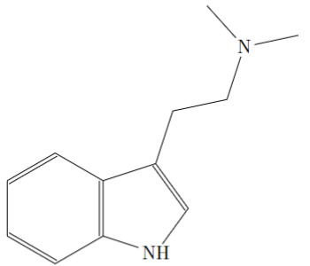
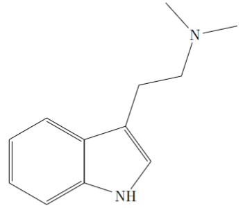

# BabyChem基础有机化学


## 想法

将手写笔记用latex写出来

## 进度

- :white_check_mark: 第一章
    - :white_check_mark: 1.1-1.3
- :white_check_mark: 第二章
    - :white_check_mark: 2.1-2.5
- :white_square_button: 第三章
    - :white_square_button: 3.1
    - :black_square_button: 3.2-3.4

## [预览](main.pdf)

|  |  |
| --- | --- |

## 遇到的困难

里面全是史山代码，tex里好多报错，不知道怎么解决，呜呜呜  
全是化学式结构图，能量曲线，能级图，好难画  
为了和手写笔记基本上吻合，花了很多功夫  

## 手动编译

* VSCode扩展下载LaTeX Workshop
* 设置>搜索`Latex-workshop › Latex: Recipes`>在 settings.json 中编辑
* 将内容替换成[.vscode/settings.json](.vscode/settings.json)
* 在main.tex中`Ctrl`+`Alt`+`B`编译成PDF

## to chemfig

先看看效果吧，这是他生成的并打印出来的



```tex
\chemfig{-[:312]N(-[:12])-[:252]-[:192]-[:252]=_[:306]-[:234]\mcfbelow{N}{H}-[:162]=^[:90](-[:18])-[:150]=^[:210]-[:270]=^[:330](-[:30])}
```

这是手写的并打印的



```tex
\chemfig{*6(-=(*5(-{N}{H}-=(-(-[::-60](-[::60]N(-[::-60])(-[::60]))))--))-=-=)}
```

[Emacs](https://www.gnu.org/software/emacs/download.html)加上[tochemfig.el](tochemfig.el)这个插件后有很多选项功能具体查看[tochemfig](https://github.com/gicrisf/tochemfig)，不过他的代码的六元环和五元环的*6/*5没用上，感觉不精简？也可能是我没用完整他的插件，有个注意的就是Emacs的复制粘贴快捷键等都不是和win一样的，这点有点不习惯

这个插件依赖于python和mol2chemfigPy3

总得来说还是一个非常不错的软件和插件，所以我发现了宝藏，我会用他来打第一个模板，这里要致谢一下

## 致谢

* [szaboqc](https://github.com/Usu171/szaboqc)
* [tochemfig](https://github.com/gicrisf/tochemfig)

## 文件下载&讲解视频

**[BabyChem基础有机化学手写笔记](https://github.com/Benzyl-titanium/BabyChem/releases/download/organic-chemistry/BabyChem.pdf)**

[](https://www.bilibili.com/video/BV11U4y1x7GL/?spm_id_from=333.1387.homepage.video_card.click&vd_source=d848090dc43c31d7970651436f34cfa5)

